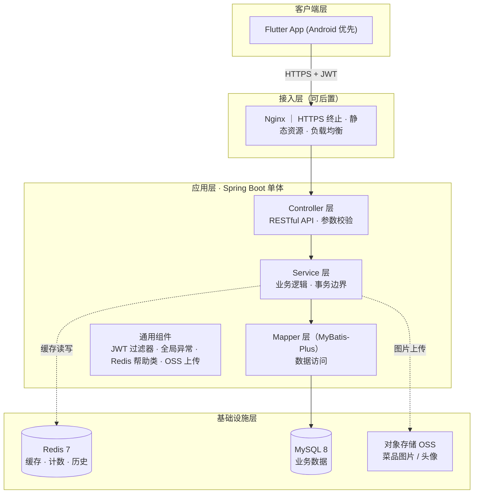
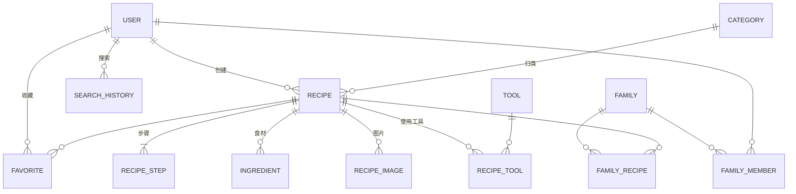
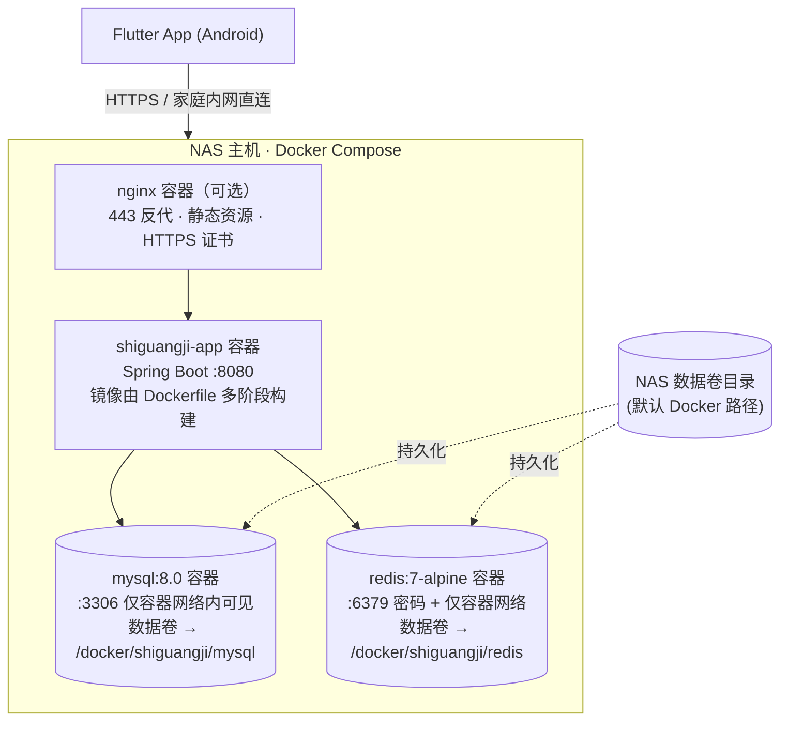

# 食光记 · 架构设计文档

> 版本：v1.0 ｜ 日期：2026-08-26 ｜ 配套设计稿：`食光记-深色玻璃版.html`（Ardot 画布 7 页深色玻璃主题）

---

## 1. 项目概述

「食光记」是一款个人食谱管理小程序级 App：用户可以浏览/搜索菜谱、查看详细做法、创建自己的菜谱（含食材、步骤、妙招、注意事项、"吃一堑长一智"经验记录）、收藏菜谱，并与家庭成员共享"家庭菜谱"。

| 端 | 技术 | 说明 |
|---|---|---|
| 前端 | **Flutter 3.x（Dart 3）** | 跨平台（Android / iOS / Web），**当前主要目标：Android** |
| 后端 | **Java 17 + Spring Boot 3.3 + Maven** | 单体分层架构，RESTful API |
| 数据库 | **MySQL 8.0**（utf8mb4） | 业务主存储 |
| 缓存 | **Redis 7.x** | 热点菜谱、搜索历史、计数器、Token 黑名单 |
| 认证 | Spring Security + JWT | 无状态认证，Access/Refresh 双 Token |

---

## 2. 总体架构



**为什么是单体而不是微服务**：初期用户量与团队规模小，单体会显著降低开发/部署/运维成本。架构上通过「包边界清晰 + Service 接口化」为未来拆分预留空间（见 §4 包结构）。

---

## 3. 前端架构（Flutter）

### 3.1 技术选型

| 关注点 | 选型 | 理由 |
|---|---|---|
| 状态管理 | **Riverpod 2.x** | 编译期安全、天然支持异步（`AsyncValue` 直接驱动瀑布流加载态） |
| 路由 | **go_router** | 声明式路由，便于深链与页面守卫（未登录 → 登录页） |
| 网络 | **dio** + 拦截器 | 统一注入 Token、401 自动刷新、日志 |
| 模型 | **json_serializable** | 类型安全，告别手写 `fromJson` |
| 本地存储 | **shared_preferences**（Token）+ **cached_network_image**（图片缓存） | 轻量够用 |
| 图片选择 | **image_picker** | 封面图/步骤图上传 |

### 3.2 分层与目录

```
lib/
├── main.dart                  # 入口：ProviderScope + MaterialApp.router
├── core/                      # 与业务无关的基础设施
│   ├── theme/                 # ★ 深色玻璃主题（设计令牌，见开发文档 §5）
│   ├── network/               # dio 封装、ApiResult、拦截器
│   ├── router/                # go_router 路由表 + 登录守卫
│   └── widgets/               # GlassCard / ChipBar / TabBar 等通用玻璃组件
├── features/                  # 按业务feature划分（对应后端模块）
│   ├── auth/                  # data/ · domain/ · presentation/
│   ├── recipe/                # 首页、搜索、分类、详情、新增
│   ├── profile/               # 个人页、家庭菜谱
│   └── ...
└── shared/                    # 跨 feature 的模型与工具
```

> 每个 feature 内部三层：`data`（API Client + DTO）、`domain`（实体与 Repository 接口）、`presentation`（页面 + Provider）。Repository 层是唯一的数据出口，方便后期加缓存或换后端。

### 3.3 页面映射（设计稿 → Flutter）

| 设计稿页面 | 路由 | 核心组件 |
|---|---|---|
| 01 首页 | `/` | 分类 ChipBar、玻璃搜索框、双列瀑布流（`flutter_staggered_grid_view`） |
| 02 搜索页 | `/search` | 历史标签（Redis）、结果瀑布流 |
| 03 分类页 | `/category/:id` | 与首页共用瀑布流组件 |
| 04 详情页 | `/recipe/:id` | 轮播 Hero、信息卡、食材清单、步骤时间线、暖橙"吃一堑长一智"卡 |
| 05 新增菜谱 | `/recipe/edit` | 12 张表单玻璃卡、动态增删食材/步骤行 |
| 06 个人页 | `/profile` | 资料卡、统计行、个人菜谱横滑、家庭菜谱列表 |
| 07 登录页 | `/login` | Logo 玻璃盒、输入框、渐变登录按钮 |

---

## 4. 后端架构（Spring Boot）

### 4.1 Maven 工程结构

```
shiguangji-server/
├── pom.xml
└── src/main/java/com/shiguangji/
    ├── ShiguangjiApplication.java
    ├── config/            # Security、Redis、MyBatis-Plus、CORS、Jackson
    ├── common/            # Result<T> 统一响应 · 错误码 · 全局异常处理器
    ├── security/          # JWT 过滤器、UserDetailsService、登录/鉴权
    ├── controller/        # REST 入口（按资源划分，薄层）
    ├── service/           # 业务逻辑（接口 + Impl，事务边界）
    ├── mapper/            # MyBatis-Plus Mapper
    ├── entity/            # 数据库实体（与表一一对应）
    ├── dto/               # 请求/响应 DTO（Vaild 校验注解）
    └── util/              # RedisKey 常量、分页封装、OSS 客户端
```

### 4.2 分层职责与规约

- **Controller**：只做参数接收 + 校验 + 调 Service，禁止写业务；
- **Service**：事务边界（`@Transactional` 只标注在写方法上），跨表逻辑在此收口；
- **Mapper**：MyBatis-Plus 单表 CRUD 用 BaseMapper，复杂查询（首页瀑布流聚合）写 XML；
- **统一响应**：`Result{code, message, data}`，错误码分域（1xxx 通用 / 2xxx 用户 / 3xxx 菜谱 / 4xxx 家庭）。

### 4.3 核心依赖（pom.xml 关键项）

```xml
<parent>
    <groupId>org.springframework.boot</groupId>
    <artifactId>spring-boot-starter-parent</artifactId>
    <version>3.3.4</version>
</parent>
<properties>
    <java.version>17</java.version>
</properties>

<dependencies>
    <dependency>org.springframework.boot:spring-boot-starter-web</dependency>
    <dependency>org.springframework.boot:spring-boot-starter-security</dependency>
    <dependency>org.springframework.boot:spring-boot-starter-data-redis</dependency>
    <dependency>org.springframework.boot:spring-boot-starter-validation</dependency>
    <dependency>com.baomidou:mybatis-plus-spring-boot3-starter:3.5.7</dependency>
    <dependency>com.mysql:mysql-connector-j</dependency>   <!-- runtime -->
    <dependency>io.jsonwebtoken:jjwt-api / jjwt-impl / jjwt-jackson:0.12.6</dependency>
    <dependency>org.projectlombok:lombok</dependency>
    <dependency>com.github.xiaoymin:knife4j-openapi3-jakarta-spring-boot-starter:4.5.0</dependency>
</dependencies>
```

---

## 5. 数据模型设计

### 5.1 ER 关系



### 5.2 表清单

| 表 | 说明 | 关键字段 |
|---|---|---|
| `user` | 用户 | username(唯一)、password_hash、nickname、phone、avatar_url |
| `category` | 分类（凉菜/热菜/鱼虾/肉类/蔬菜） | name、sort、icon |
| `recipe` | 菜谱主表 | user_id、category_id、title、description、cover_url、servings、cook_minutes、difficulty、tips(妙招)、notes(注意事项)、experience_text/experience_date(吃一堑长一智)、status |
| `recipe_image` | 菜谱图集 | recipe_id、url、sort |
| `ingredient` | 食材（type=1 主料 / 2 配料） | recipe_id、name、amount |
| `recipe_step` | 做法步骤 | recipe_id、step_no、content |
| `recipe_tool` | 菜谱-工具关联 | recipe_id、tool_id |
| `tool` | 烹饪工具字典（炒锅/蒸锅/烤箱…） | name |
| `favorite` | 收藏 | user_id + recipe_id 联合唯一 |
| `search_history` | 搜索历史 | user_id、keyword、search_time |
| `family` | 家庭 | name、owner_id、cover_url |
| `family_member` | 家庭成员 | family_id、user_id、role(OWNER/MEMBER) |
| `family_recipe` | 家庭菜谱收录 | family_id、recipe_id |

> 完整 DDL 见《食光记-开发文档.md》§3。

---

## 6. Redis 设计

### 6.1 Key 规划

| Key | 类型 | TTL | 用途 |
|---|---|---|---|
| `token:blacklist:{jti}` | string | = 剩余有效期 | 登出后拉黑 Access Token |
| `refresh:{userId}:{deviceId}` | string | 30d | Refresh Token（支持多端登录/踢出） |
| `recipe:detail:{id}` | string(JSON) | 30min | 菜谱详情（读多写少，发布/编辑时删除） |
| `recipe:home:{categoryId}:{page}` | string(JSON) | 5min | 首页/分类瀑布流分页缓存 |
| `recipe:hot` | zset | 每日刷新 | 热门菜谱榜（score = 浏览+收藏加权） |
| `search:history:{userId}` | list（LPUSH+LTRIM 20） | 90d | 搜索历史（去重） |
| `search:hot` | zset | 1h | 热搜词（incr keyword score） |
| `counter:favorite:{recipeId}` | string | 永久 | 收藏数（先扣减 Redis，定时任务回写 MySQL） |
| `counter:view:{recipeId}` | string | 永久 | 浏览量（同上，1h 合并落库一次） |

### 6.2 缓存策略

- **读**：详情页/首页走 cache-aside；未命中回源并写缓存；
- **写**：菜谱发布/编辑/删除 → 直接 `DEL` 对应缓存（不做更新，防脏读）；
- **计数**：收藏/浏览只操作 Redis，定时任务（每小时）批量 `INCRBY` 回写 MySQL，避免高频行锁；
- **防击穿**：详情缓存使用逻辑过期或 `Redisson` 分布式锁二选一（初期用 `@Cacheable` + 短 TTL 即可）。

---

## 7. 认证与安全

1. **登录**：`POST /api/v1/auth/login` 校验 BCrypt 密码 → 签发 `accessToken`（2h，JWT 携带 userId/jti）+ `refreshToken`（30d，存 Redis）；
2. **请求鉴权**：`JwtAuthenticationFilter` 校验签名与黑名单；
3. **续期**：accessToken 过期 → 前端拦截器用 refreshToken 换新（静默刷新）；
4. **登出**：accessToken jti 写入黑名单，删除 refresh key；
5. **接口权限**：浏览/搜索匿名可用；发布、收藏、家庭管理需登录（`@PreAuthorize("isAuthenticated()")` 或路由级别配置）；
6. **其他**：全站 HTTPS；密码 BCrypt；OSS 直传（后端签名，图片不过应用服务器）；全局参数校验（`spring-boot-starter-validation`）。

---

## 8. 部署架构（NAS · Docker 一键部署）

**部署形态**：后端应用 + MySQL + Redis 全部容器化，通过 `docker-compose.yml` 编排，部署在 NAS（群晖/威联通/UNRAID 或自建主机均可）上。服务器上只需一条命令即可拉起整套后端。



### 8.1 部署原则

| 项 | 方案 |
|---|---|
| 编排 | `docker-compose.yml` 一份文件定义 app + mysql + redis，`docker compose up -d` 一键启动 |
| 镜像 | app 用**多阶段构建**（Maven 构建层 + JRE 运行层，最终镜像约 300MB）；MySQL/Redis 用官方镜像 |
| 数据持久化 | MySQL 数据、Redis 数据、配置文件全部挂载到 NAS 目录（`/volume1/docker/shiguangji/...`），容器随删随建、数据不丢 |
| 网络隔离 | 三个容器放同一自定义 bridge 网络；MySQL/Redis **不映射宿主机端口**（或仅映射到内网 IP），只允许 app 容器访问 |
| 健康与自愈 | 全部容器配置 healthcheck + `restart: unless-stopped`，NAS 重启后自动拉起整套服务 |
| 环境配置 | 数据库/Redis/JWT 密钥全部走 `.env` 文件，一份 `.env` + 一份 `docker-compose.yml` 即是完整部署物 |
| 镜像分发 | 开发机 `docker build` 后推送镜像仓库（Docker Hub / 阿里云 ACR / NAS 本地 Registry），NAS 上 `docker compose pull && docker compose up -d` 更新 |
| 备份 | NAS 定时任务每日 `mysqldump` 到数据卷目录，配合 NAS 自身快照/异地备份 |

### 8.2 服务器一键运行

```bash
# NAS 上（首次）：拉取编排文件与镜像
git clone <你的仓库> shiguangji && cd shiguangji/deploy
cp .env.example .env && vim .env        # 填好密码/JWT密钥
docker compose up -d                     # 一键启动 app + mysql + redis

# 日常更新（新版本发布）
docker compose pull app && docker compose up -d app

# 查看状态 / 日志
docker compose ps && docker compose logs -f app
```

> 完整 `Dockerfile`、`docker-compose.yml`、`.env`、NAS 注意事项（时区/镜像加速/HTTPS/备份）见《食光记-开发文档.md》§7。


---

## 9. 非功能性约定

| 项 | 约定 |
|---|---|
| 分页 | `page` 从 1 开始，`size` 默认 10，瀑布流建议 6/页 |
| 时间 | 统一 ISO-8601（`yyyy-MM-dd HH:mm:ss`），东八区 |
| 错误码 | `0=成功`；`401xx` 未认证；`403xx` 无权限；`4xx/5xx` 参见开发文档错误码表 |
| 日志 | Logback 滚动文件，敏感字段（手机号/密码）脱敏 |
| 版本 | API 以 `/api/v1` 前缀冻结，破坏性变更升 v2 |

---

## 10. 里程碑建议

| 阶段 | 周期 | 交付 |
|---|---|---|
| M1 基础框架 | 1 周 | 前后端工程骨架、登录注册跑通、CI 脚本、`deploy/` Docker 编排就绪（本地 compose 开发） |
| M2 菜谱核心 | 2 周 | 菜谱 CRUD、分类、首页/详情接口与 Flutter 页面 |
| M3 搜索与收藏 | 1 周 | 搜索（MySQL LIKE→FULLTEXT）、历史、收藏 |
| M4 个人与家庭 | 1 周 | 个人页统计、家庭菜谱共享 |
| M5 缓存与体验 | 1 周 | Redis 全量接入、图片 OSS、离线占位 |
| M6 发布 | 0.5 周 | NAS 一键部署上线（compose up）、签名 APK 内测分发、崩溃收集（Sentry 可选） |
